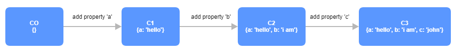
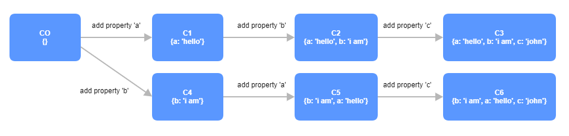

## Hidden classes
Каждый раз, проверяя наличие св-ва у объекта, js тратит время на динамические проверки. Поэтому в v8 компилятор под
каждый объект создаёт класс, который потом этот объект подменяет. В классе не нужно проверять
наличие св-в, поэтому так выполнение идёт быстрее.

Под каждое новое добавление св-ва в объект создается новый класс. Чтобы ускорить работу v8
и не тратить больше памяти на классы, желательно сократить места, где динамически добавляются
новые св-ва и поэтому создаются классы.

Добавление работает как граф, а каждое изменение - новая ветвь. То есть, {} -> {a} -> {a, b} и {} -> {b} -> {b, a} создаст не 4 hidden
класса, а 5 ({b, a} и {a, b})

