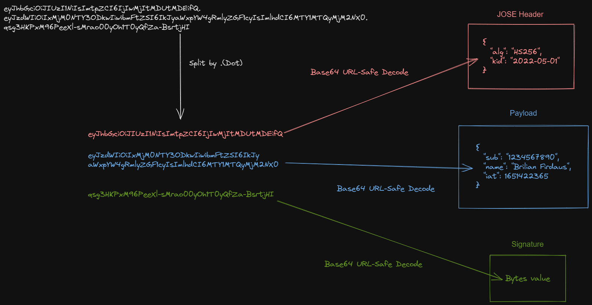

### JWT
json web token - defined in [rfc7519](https://tools.ietf.org/html/rfc7519)
В базовой реализации позволяет проверять подлинность отправителя и целостность данных, НО НЕ ИХ КОНФИДЕНЦИАЛЬНОСТЬ.
Он только подписывает, но не шифрует, поэтому payload из токена при перехвате можно прочитать.
Состоит из base64-encoded частей, разделенных точками. 

Предназначен для использования там, где другие средства использовать трудно из-за [ограниченного объема вмещаемых данных](https://datatracker.ietf.org/doc/html/rfc7519#section-1). К примеру,
в заголовках http запроса или в параметрах url.

Есть два основных варианта - JWS и JWE.
JSON Web Signature (JWS)
 - JWS (RFC 7515), which stands for JSON Web Signature, is one of the structures used by JWT.
 It's the most common implementation of the JWT. JWS consists of 3 parts: the JOSE header, payload, and signature.
 - JWE (RFC 7516), unlike JWS, encrypts its content using an encryption algorithm.
 The only one that can see what is inside the JWT is the one with the key. В отличие от обычного варианта, шифрует.

Произносится аналогично с английским словом 'jot'

[Список некоторых описанных в стандарте, но необязательных полей(claim-ов)](https://datatracker.ietf.org/doc/html/rfc7519#section-4)

